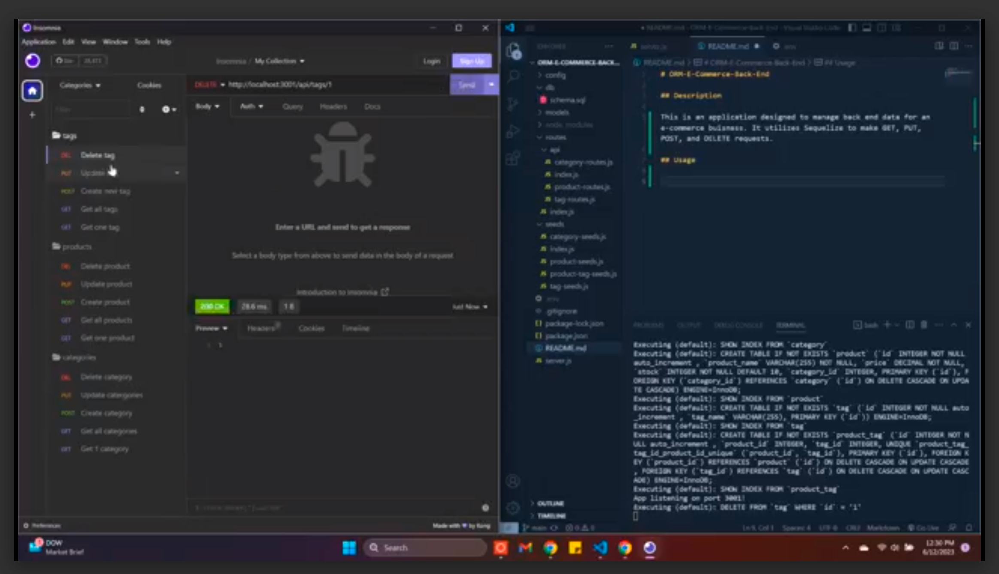

# ORM-E-Commerce-Back-End

## Description

This is an application designed to manage back end data for an e-commerce buisness. The application uses MySQL2 and Sequilize to connect to a MySQL database. It utilizes Sequelize to make GET, PUT, POST, and DELETE requests. The database itself contains tables for; categories, products, categories, and tags.

## Usage

The neccesary dependencies for this application are "dotenv: v8.2.0", "express: v4.17.1", "mysql2: v2.1.0", "sequelize: v5.21.7". Which can be install by running "npm install" and using the package name, which will install the most current version. If you would like to use a specific version use "@[version-number]" after the package name. First, log into MySQL by entering "mysql -u root -p" and then enter your password. Create the database by entering "source ./db/schema.sql". Next, the database needs seeds, enter "node seeds/index.js". Finally, the application is initiated by entering "npm start". Once the server is running, the user can test API routes using Insomnia or a similar tool to explore the routes and HTTP requests. To watch a video breakdown, click [here](https://drive.google.com/file/d/1ZDWGK1FR5lf7MJlStksGYKvxbSxEX13N/view)

